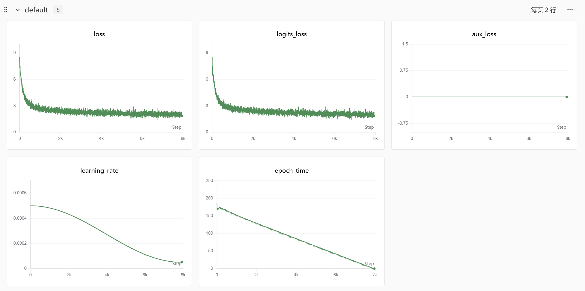

# MiniMind 复现技术报告整理稿

本次实践完成了 MiniMind 的本地预训练、全参数 SFT、SwanLab 训练观察和生成样例对比。已保存三个自训权重及核心代码笔记。现有结果显示模型学到了基本对话形式，但技术问题仍有明显知识错误；增加 SFT 轮数后，回答长度增加并未在样例中带来明确的准确性改善。

## 复现目标与来源

目标是理解从 JSONL 数据、tokenizer、Dataset 到 Transformer、训练循环和自回归生成的完整链路。模型代码来自 [MiniMind 上游仓库](https://github.com/jingyaogong/minimind)。用户确认数据来自 Hugging Face mini 版，保存脚本对应 `pretrain_t2t_mini.jsonl` 和 `sft_t2t_mini.jsonl`；汇总记录历史代码 commit 为 `4497610ec0a85d2d0a3db488fd4c1e2f12a416ab`；历史数据 revision 与 SHA256 未提供。

## 历史训练环境与实际配置

补充汇总记录 RTX 5070 Laptop GPU 8 GB、Python 3.10.20、torch 2.11.0+cu128、transformers 4.57.6、datasets 3.6.0 和 SwanLab 0.7.11。完整运行环境快照与元数据已归档，Python 与包版本已核对，详见 [环境记录](../configs/environment_record.md)。

模型约 63.91M 参数，hidden_size 768、8 层、8 Q 头和 4 KV 头、词表 6400、未开启 MoE。实现包括 RMSNorm、RoPE、GQA 和 SwiGLU。数据使用全量 mini 文件：预训练 1,270,238 条、SFT 905,718 条，无人工筛选。

| 参数 | 预训练实际值 | SFT 1 轮 | SFT 2 轮 |
| --- | --- | --- | --- |
| epochs | 1 | 1 | 2 |
| batch_size | 16 | 8 | 8 |
| accumulation_steps | 8 | 1 | 1 |
| learning_rate | 5e-4 | 1e-5 | 1e-5 |
| max_seq_len | 340 | 768 | 768 |
| from_weight | none | pretrain | pretrain |

两次 SFT 是从同一个 pretrain 权重开始的独立实验；2 轮结果不是在 1 轮权重上继续训练。初始种子为 42，保存脚本第二轮使用 43。原运行命令及详细参数见 [实验记录](experiment_records.md)。

## 保存的实验产物

| 产物 | 本地路径 | 状态 |
| --- | --- | --- |
| 预训练权重 | checkpoints/pretrain_768.pth | 用户确认自训 |
| SFT 1 轮权重 | checkpoints/sft epoch=1/full_sft_768.pth | 用户确认自训 |
| SFT 2 轮权重 | checkpoints/sft epoch=2/full_sft_e2_768.pth | 用户确认自训 |

权重路径相对于项目根目录，均仅本地保存。代码保存逻辑将模型 state_dict 转成半精度写入 `.pth`，另用训练工具保存续训状态；本轮未加载权重验证，不能断言这些文件包含优化器或可直接断点续训。

## 训练曲线观察

补充汇总提供的训练记录首值至末值为：预训练 8.5076 至 1.8339，SFT 1 轮 2.6600 至 1.6698，SFT 2 轮 2.6603 至 1.7262。原始标量 CSV 和控制台日志已转移，并核对以上数值；它们不是验证集均值。下图保留原训练截图。原报告描述 aux_loss 为 0，与未开启 MoE 的配置相符。训练 loss 降低反映训练目标的拟合改善，不能单独证明知识准确性或泛化能力提升。

## 生成样例对比

原报告围绕介绍自己与解释 Transformer 注意力机制等问题作定性分析。SFT 1 轮能够形成基本中文回答，但出现重复、异常符号和技术概念错误；2 轮回答更长，却仍存在跑题与无关代码。作者模型在所示样例中更相关、更稳定，汇总已记录其来源为 ModelScope `gongjy/minimind-3`，历史下载 revision 尚未固定。

样例见 [SFT 1 轮](<../experiments/evaluations/sft epoch=1/自己的模型1.png>)、[SFT 2 轮](<../experiments/evaluations/sft epoch=2/1.png>) 和 [作者模型](../experiments/evaluations/作者权重/作者模型1.png)，各目录均保留两张截图。

汇总记录三个模型使用默认 temperature 0.85、top_p 0.95 和 max_new_tokens 8192；原评估脚本对每个问题随机设置 seed，旧截图没有固定种子的评测协议。现有观察不足以证明 2 轮模型过拟合，也不能将与作者模型的差异归因于单一因素；数据、模型版本和生成配置均可能影响结果。

## 当前局限与后续工作

历史代码 commit、训练命令和实际参数已由补充汇总提供。原始日志已转移并核验，数据加载模块、tokenizer、依赖快照与许可证也已补齐；三次元数据确认历史 commit 和运行命令。没有重新训练，也未安装依赖或执行模型，运行兼容性仍未验证。随后在固定问题、固定 seed 和一致采样配置下评估相关性、准确性、重复与异常符号，并记录速度及运行环境。LoRA、DPO、PPO、GRPO、MoE 和多模态模型属于后续学习方向，不列作本次已完成成果。

## 个人贡献

本次工作包括 Windows CUDA 与 DLL 环境排查、正式训练及 SwanLab 记录、中文源码注释、学习笔记和生成结果分析。历史代码修改为注释性质，没有模型结构或算法创新；上游 issue 771 修复不计为个人代码贡献。详见 [个人贡献记录](personal_contribution.md)。
